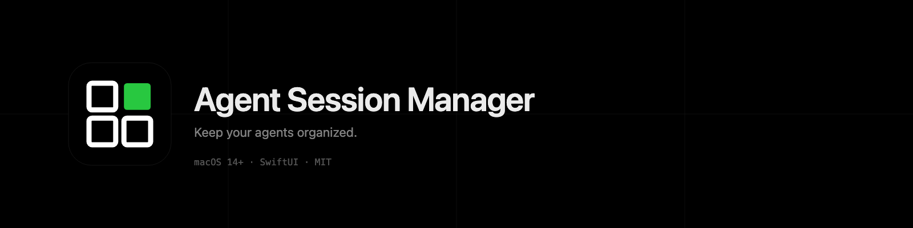

 
 

Keeps Claude Code, Codex, Cursor, OpenCode, and Oh My Pi managed in a window optimized for multi-agent workflows.

## Features

**Tabs** represent a working directory. Each tab has a name and a root directory. Switch between them with ⌘1–⌘9.

**Panes** are terminal sessions inside a tab. Creating an agent pane launches the selected tool (Claude Code, Codex, Cursor, OpenCode, or Oh My Pi) in an isolated git worktree. You can also open a plain shell in an existing pane. Panes auto-arrange in a grid (1×1 → 2×1 → 2×2 → 3×2 → 3×3) as you add more.

**Status line** — each pane can show a live, configurable status bar at the bottom with app-owned and tool-specific information such as the model, worktree name, cost, context usage, and more. Available items vary by tool, and custom fields are supported in Settings → Status Line.

**CLI options** — each supported tool has its own catalog of configurable CLI options in Settings → Harnesses. Enabled options appear as toggles and text fields in the New Pane sheet. Custom flags are also supported.

**Session persistence** — tabs and pane names are saved and restored on relaunch. Any pane whose worktree still exists on disk is restarted automatically.

**Keyboard shortcuts:**
- ⌘T — new tab
- ⌘P — new pane
- ⌘W — close active pane
- ⌘K — close active tab
- ⌘1–⌘9 — switch to tab by index

**Observability / Debugging** — unified logs (Console.app / `log stream`) and Instruments signposts are always on, no setup needed. Enable **Settings → Debug → Enable Debug Mode** for durable trace/invariant JSONL files and the Trace (`⌘⇧D`) and Invariant (`⌘⇧I`) dashboards.
